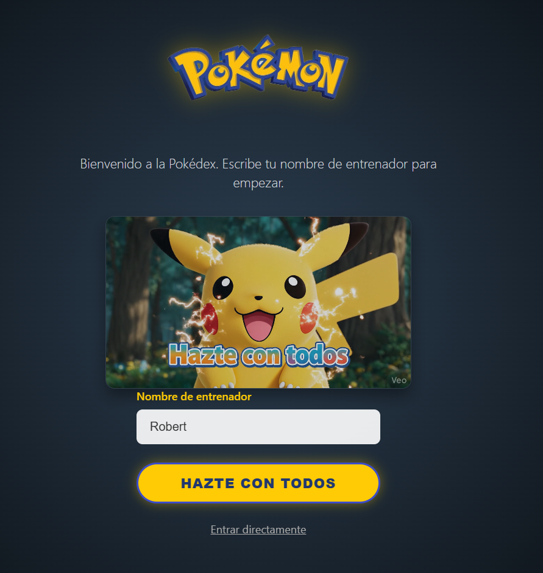
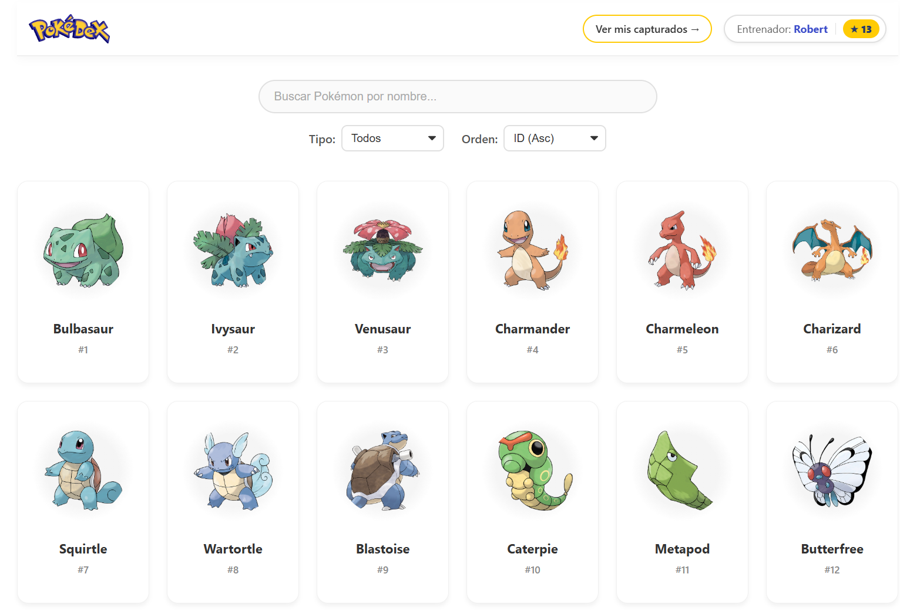
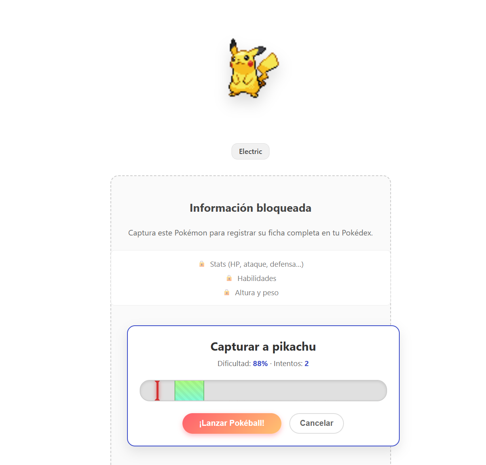
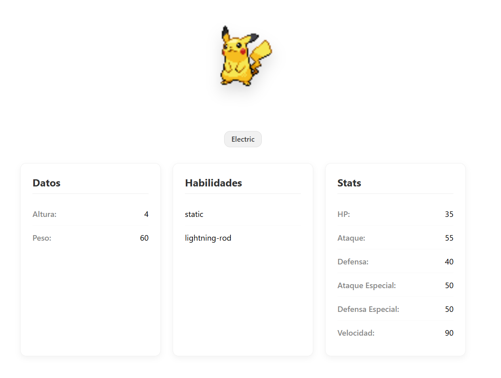
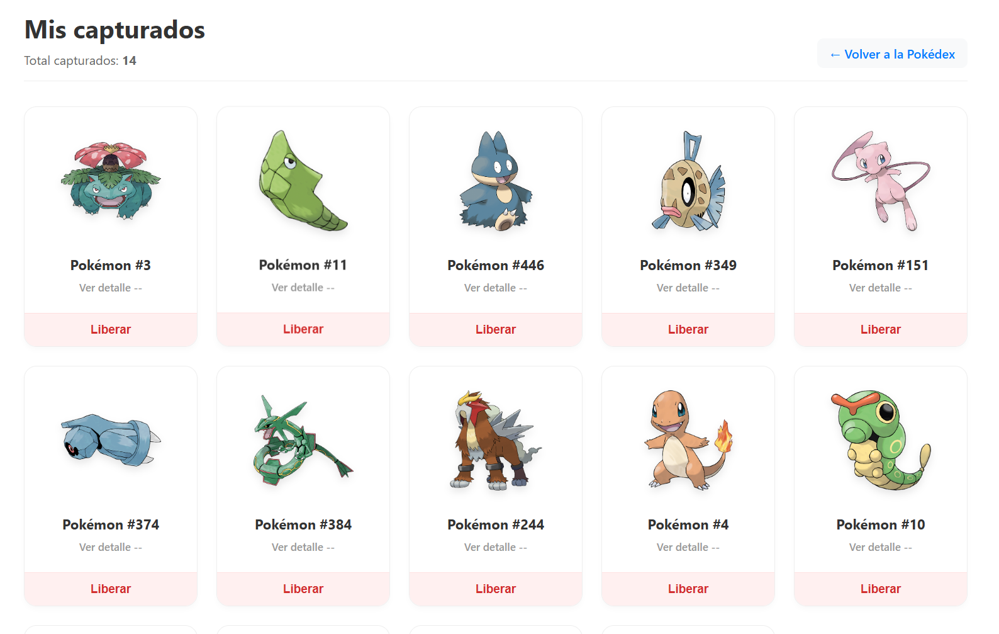

# Go-Pokémon 🚀

Go-Pokémon es una aplicación interactiva desarrollada con **React y Vite** que permite a los usuarios explorar el universo Pokémon en tiempo real. El proyecto combina la consulta de datos de una API externa con una mecánica de juego de "captura" y persistencia de datos local.

## 📸 Vista Previa del Proyecto

### Exploración y Captura
| Bienvenida al Entrenador | Listado General (Pokédex) |
| :---: | :---: |
|  |  |

### Mecánicas de Juego
| Sistema de Captura | Estadísticas y Detalle | Colección Personal |
| :---: | :---: | :---: |
|  |  |  |

---

## 🌟 Características Principales

- **Exploración en Tiempo Real:** Catálogo completo de Pokémon obtenido de [PokeAPI](https://pokeapi.co/).
- **Mecánica de Captura:** Reto interactivo basado en la estadística de velocidad del Pokémon.
- **Persistencia de Datos:** Uso de `LocalStorage` para guardar el equipo capturado y el nombre del entrenador.
- **Sistema Avanzado de Búsqueda:** Filtrado por tipo, búsqueda por nombre y ordenación (ascendente/descendente).
- **Acceso Restringido:** Los detalles avanzados de un Pokémon solo son visibles si este ha sido capturado previamente.

## 🛠️ Tecnologías y Herramientas

- **Framework:** React + Vite
- **Navegación:** React Router
- **Estado Global:** Context API + Hooks personalizados
- **Estilos:** CSS Modules
- **API:** PokeAPI (v2)

## 🏗️ Arquitectura del Proyecto

La aplicación sigue una estructura organizada para facilitar la escalabilidad:

- `/services`: Lógica de conexión con la API (`fetch`) y mapeo de datos (`PokemonMapper`).
- `/context`: Gestión del estado global de capturas y sincronización con el almacenamiento.
- `/hooks`: Hooks personalizados para lógica de negocio (`usePokemonList`, `usePokemonDetail`, `useCapturados`).
- `/store`: Funciones auxiliares para la manipulación de `localStorage`.
- `/components`: Componentes reutilizables y de interfaz.

## 🚀 Instalación y Uso

1. **Clona este repositorio:**
   ```bash
   git clone [https://github.com/robertSpacecraft/Proyecto-DWCliente--go-pokemon.git](https://github.com/robertSpacecraft/Proyecto-DWCliente--go-pokemon.git)